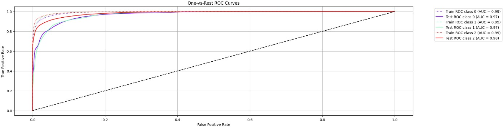
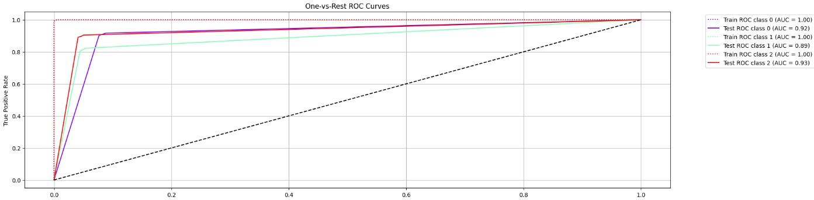
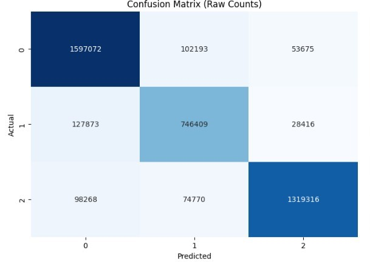
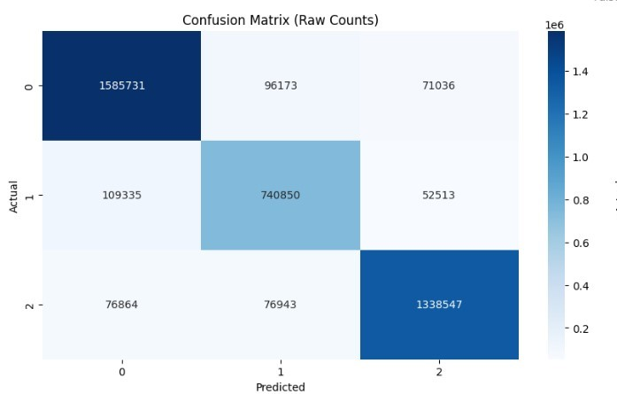
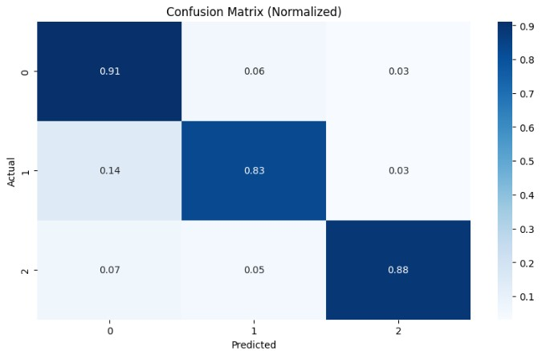
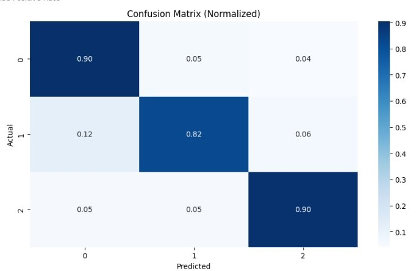

# Microsoft: Classifying Cybersecurity Incidents with Machine Learning

## Overview
This repository implements a machine learning pipeline for classifying cybersecurity incidents into three categories: **True Positive (TP)**, **Benign Positive (BP)**, **and False Positive (FP)**. Leveraging the **Microsoft GUIDE dataset**, the project employs sophisticated data preprocessing, feature engineering, and classification techniques to enhance model accuracy and assist Security Operation Centers (SOCs) in automating the incident triage process.

## Key Features

### Extensive Data Preprocessing and Feature Engineering:
- Handling null values and removing irrelevant features.
- Extracting time-based features (day, hour, etc.) from timestamps.
- Encoding categorical variables using label encoding.
- Performing feature correlation analysis to drop highly correlated features.

### Machine Learning Model Training and Optimization:
- **Baseline models:** Logistic Regression and Decision Trees.
- **Advanced models:** Random Forest, Gradient Boosting, XGBoost, and LightGBM.
- Techniques to handle class imbalance: **SMOTE and class-weight adjustments**.
- Hyperparameter tuning using **RandomizedSearchCV**.

### Model Evaluation:
- **Performance Metrics:** Macro-F1 score, precision, recall.
- **Model Comparison:** Evaluating multiple models to select the best performer.

### Deployment-Ready Solution:
- Final model saved using **joblib** for easy deployment.

## Business Use Cases
### 1. Security Operation Centers (SOCs)
- Automate the triage process to prioritize critical threats efficiently.

### 2. Incident Response Automation
- Enable systems to suggest appropriate actions for incident mitigation.

### 3. Threat Intelligence
- Enhance detection capabilities using historical evidence and customer responses.

### 4. Enterprise Security Management
- Reduce false positives and ensure timely addressing of true threats.

## Dataset
The **Microsoft GUIDE dataset** provides comprehensive telemetry data across three hierarchies: **evidence, alerts, and incidents**. Key highlights include:

- **GUIDE_train.csv** (2.43 GB)
- **GUIDE_test.csv** (1.09 GB)
- **[Kaggle Link to Dataset](https://www.kaggle.com/datasets/Microsoft/microsoft-security-incident-prediction)** 
---
### 🚀 Get Started
To run the project, follow these steps:
```bash
# Clone the repository
git clone https://github.com/Pushparaj95/CS_Incident_Prediction.git
cd cybersecurity-ml

# Run preprocessing and model training
python cs-model.ipynb

```

## **Overview**
This report compares the performance of **Random Forest Classifier** and **Decision Tree Classifier** after hyperparameter tuning and optimization, evaluated on a large, imbalanced multiclass dataset.

---

## **Performance Metrics**

| Metric | Decision Tree Classifier | Random Forest Classifier |
|--------|--------------------------|--------------------------|
| **Overall Accuracy** | 88% | 88% |
| **Macro Avg Precision** | 0.87 | 0.88 |
| **Macro Avg Recall** | 0.87 | 0.87 |
| **Macro Avg F1-Score** | 0.87 | 0.87 |
| **Weighted Avg Precision** | 0.88 | 0.88 |
| **Weighted Avg Recall** | 0.88 | 0.88 |
| **Weighted Avg F1-Score** | 0.88 | 0.88 |
| **Macro-Averaged AUC** | 0.913 | 0.975 |
| **Weighted-Averaged AUC** | 0.916 | 0.975 |

---

## **Final Report**

### **ROC Curves**

#### **Random Forest Classifier**:
The **ROC curve** for the Random Forest model demonstrates its ability to separate the classes effectively, with an **AUC of 0.975**. The model performs well across all classes.



#### **Decision Tree Classifier**:
The **ROC curve** for the Decision Tree model shows a slightly lower **AUC of 0.913**, but it still performs well in class separation.



---

### **Confusion Matrix**

| Random Forest Classifier | Decision Tree Classifier |
|--------------------------|--------------------------|
| **Raw Confusion Matrix** | **Raw Confusion Matrix** |
|  |  |
| **Normalized Confusion Matrix** | **Normalized Confusion Matrix** |
|  |  |

---

## **Key Insights**

- **Random Forest Classifier**:
  - Higher **Macro-Averaged AUC (0.975)** compared to the Decision Tree model (0.913).
  - Performs better with **higher recall for Class 0** (0.91) and **Class 2** (0.88).
  - Slightly better performance on **Class 1** in terms of recall (0.83).
  
- **Decision Tree Classifier**:
  - Slightly lower **AUC (0.913)** compared to Random Forest but still a strong performer.
  - Performs slightly better in terms of **precision** for **Class 0** (0.89) and **Class 2** (0.92).
  - The **simplicity** of the Decision Tree makes it a **faster model**.

- **Both Models**:
  - Handle **imbalanced classes** effectively.
  - Show good **performance across all classes** with minor differences in recall for **Class 1**.

---

## **Conclusion**

- **Random Forest Classifier** is the **preferred model** due to its higher **AUC scores** and **better recall** for the minority class.
- **Decision Tree Classifier** is an alternative, suitable for **faster computations** or simpler applications where model interpretability is key.

Both models demonstrate robustness in handling multiclass imbalanced datasets and are ready for deployment.

---


### 🔗 References
- [Microsoft GUIDE Dataset](https://www.kaggle.com/datasets/Microsoft/microsoft-security-incident-prediction) 
- [Scikit-Learn Documentation](https://scikit-learn.org/stable/)
- [XGBoost Documentation](https://xgboost.readthedocs.io/en/stable/)

